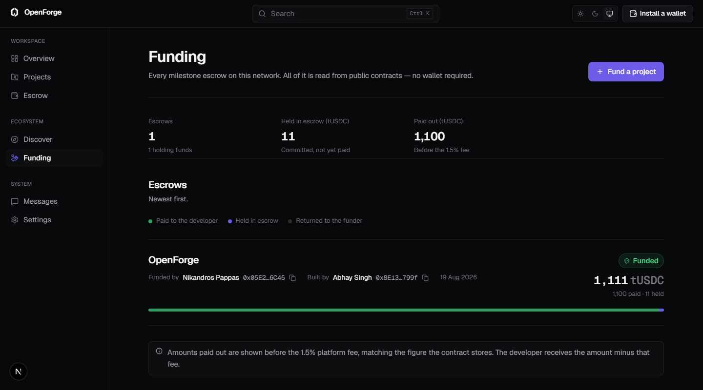
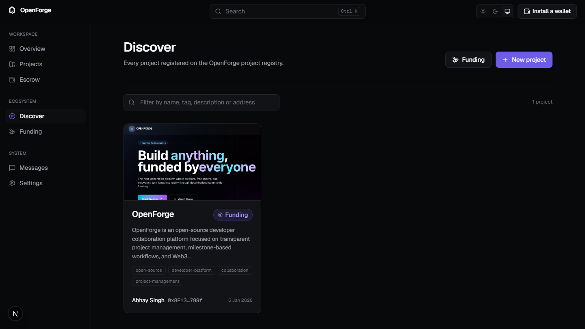
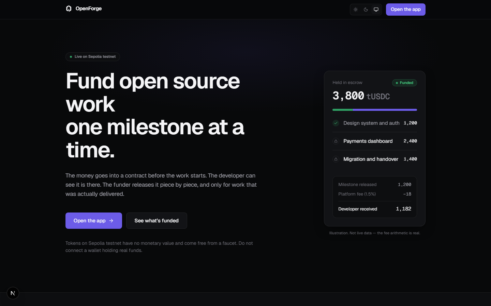
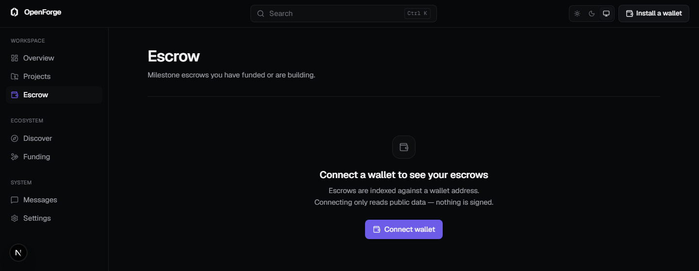

# OpenForge

A workspace for funding open source work through milestone escrow.

A funder deposits into a contract before work begins; the developer can verify
the money is there; each milestone is paid out only when the funder approves
it. Projects, profiles and escrows all live on chain, and their descriptive
content lives on IPFS.

**This is a prototype on the Sepolia test network.** The tokens involved have
no monetary value, the contracts have not been audited, and there is no
arbitration or recovery process. Do not connect a wallet holding real funds.
See [SECURITY.md](SECURITY.md) for what that means in detail.



---

## Screenshots

**Discover** — every project on the registry, with metadata and cover images
resolved from IPFS on the server.



**Landing** — the proposition, and the fee arithmetic shown honestly. The panel
is labelled as an illustration rather than dressed up as live data.



**Escrow** — reads are public, so the empty state explains what connecting does
and states that nothing is signed.



Regenerate after a design change:

```bash
npm run dev            # in another terminal
npm run screenshots
```

The script uses whichever Chrome or Edge is already installed rather than
downloading one, and captures only pages that render without a wallet.

---

## Repositories

| Repository | Contains |
|---|---|
| [OpenForge](https://github.com/Asmodeus14/OpenForge) | This app — the Next.js frontend |
| [OpenForge-Backend](https://github.com/Asmodeus14/OpenForge-Backend) | Chat: Express, Socket.IO, Postgres |
| [OpenForge-Contracts](https://github.com/Asmodeus14/OpenForge-Contracts) | Solidity contracts and deployment records |

### Deployed contracts — Sepolia (chain 11155111)

| Contract | Address |
|---|---|
| ProfileRegistry | [`0xb8c5a55D3b0E838e2f96cBdF893f90c5362F3E46`](https://sepolia.etherscan.io/address/0xb8c5a55D3b0E838e2f96cBdF893f90c5362F3E46) |
| ProjectRegistry | [`0x8796CbE1a841690E51DB3212C88533c0213c66d2`](https://sepolia.etherscan.io/address/0x8796CbE1a841690E51DB3212C88533c0213c66d2) |
| EscrowFactory | [`0x427A2618c0A9251cc7a71058510c9197b2914249`](https://sepolia.etherscan.io/address/0x427A2618c0A9251cc7a71058510c9197b2914249) |

Milestone escrows are deployed per project by the factory, so each one has its
own address. See [docs/CONTRACTS.md](docs/CONTRACTS.md).

---

## Quick start

```bash
npm install
cp .env.example .env.local   # then fill in the values — see below
npm run dev                  # http://localhost:3000
```

| Command | Does |
|---|---|
| `npm run dev` | Development server with hot reload |
| `npm run build` | Production build, including a full type check |
| `npm run start` | Serve the production build |
| `npm run lint` | ESLint, including the React Compiler rules |

Before pushing, all three of `npx tsc --noEmit`, `npx eslint .` and
`npm run build` should pass. The build type-checks, so a type error fails it.

---

## Environment

Copy `.env.example` to `.env.local`. Two groups, and the distinction matters.

### Server only — never sent to the browser

| Variable | Purpose |
|---|---|
| `PINATA_JWT` | Pinning credential. Preferred. |
| `PINATA_API_KEY` / `PINATA_API_SECRET` | Fallback credential pair. |

These are read exclusively by `app/api/ipfs/route.ts`. They have no
`NEXT_PUBLIC_` prefix and therefore never reach the client bundle.

> The previous Vite application prefixed these `VITE_`, which compiled them
> into the JavaScript served to every visitor. Anyone loading the site could
> read them out and pin or unpin content with the project's account. Moving
> uploads behind a server route is the reason this app is a Next app.

### Public — safe in the client bundle

| Variable | Purpose |
|---|---|
| `NEXT_PUBLIC_PINATA_GATEWAY` | Dedicated Pinata gateway host. |
| `NEXT_PUBLIC_PINATA_GATEWAY_TOKEN` | Read-only token scoped to that gateway. |
| `NEXT_PUBLIC_SEPOLIA_RPC_URL` | Sepolia JSON-RPC endpoint. |
| `NEXT_PUBLIC_API_URL` | Chat backend base URL. |
| `NEXT_PUBLIC_SOCKET_URL` | Chat websocket URL. Defaults to the API URL. |

**Configure the dedicated gateway.** Public IPFS gateways are unreliable enough
that the old app, which read only from them behind a 3-second abort, never
loaded project metadata, avatars or cover images at all — a bug that presented
as "IPFS is slow".

A dedicated gateway is strongly preferred but no longer trusted. It was
originally measured at 172 ms warm against public gateways timing out at 15 s.
Re-measured later it answered in 1.5 s and 2.0 s and then hung past 20 s, so
`lib/ipfs.ts` now gives it a 700 ms head start and races the public gateways
after that rather than waiting on it. Resolved content is cached by CID
permanently, since a CID is a hash of its own bytes and cannot go stale.

---

## Deployment

The frontend deploys to Vercel; the chat backend to Render.

**On Vercel**, set every variable from the table above under Settings →
Environment Variables. Two of them point at the backend:

```
NEXT_PUBLIC_API_URL=https://your-backend.onrender.com/api
NEXT_PUBLIC_SOCKET_URL=https://your-backend.onrender.com
```

Set both. The socket URL falls back to the API URL, and that value ends in
`/api`, which socket.io reads as a *namespace* — the connection then fails
while REST keeps working.

> `NEXT_PUBLIC_*` values are compiled into the bundle at build time, not read
> at runtime. Changing one does nothing until you redeploy.

**On Render**, `CORS_ORIGIN` must list your exact frontend origins, **with the
scheme**:

```
CORS_ORIGIN=https://your-app.vercel.app,http://localhost:3000
```

An entry without `https://` matches nothing — the `Origin` header is always
scheme, host and port — and the failure looks exactly like the backend being
down, because the server returns a normal `200` and only the browser discards
it. The backend warns about scheme-less entries at startup and logs every
refused origin.

Note that Vercel preview deployments get a new hostname per commit, so previews
need their origin added too.

---

## Documentation

| Document | Covers |
|---|---|
| [docs/ARCHITECTURE.md](docs/ARCHITECTURE.md) | Directory layout, server/client split, data flow |
| [docs/DESIGN.md](docs/DESIGN.md) | Design tokens, type scale, component rules |
| [docs/TRUST.md](docs/TRUST.md) | The transaction model, disclosures, money arithmetic |
| [docs/CONTRACTS.md](docs/CONTRACTS.md) | Deployed addresses and every contract behaviour the UI relies on |
| [docs/DECISIONS.md](docs/DECISIONS.md) | What was removed and why; known limitations |

Read `docs/CONTRACTS.md` before changing anything that touches money. It
records several behaviours that are not obvious from the ABI and that the
interface depends on being correct about.

| | |
|---|---|
| [CONTRIBUTING.md](CONTRIBUTING.md) | How to set up, verify and submit a change |
| [SECURITY.md](SECURITY.md) | Reporting a vulnerability, and what this project does not guarantee |
| [CODE_OF_CONDUCT.md](CODE_OF_CONDUCT.md) | Contributor Covenant 2.1 |

---

## Stack

- **Next.js 16** (App Router) and **React 19**
- **TypeScript**, strict, with `noUnusedLocals`, `noUnusedParameters` and
  `erasableSyntaxOnly`
- **Tailwind CSS v4**, configured in CSS via `@theme inline`
- **ethers v6** for all chain access
- **@tanstack/react-query** for client-side caching
- **Radix UI** primitives, **cmdk** for the command palette
- **socket.io-client** for chat

Deployed only to Sepolia. Everything else is a designed wrong-network state.

---

## Verification

There is no test runner. Correctness is checked by scripts that run against the
real deployment, which for a project this size catches more than mocks would:

```bash
npx tsx scripts/verify-core.ts       # chain reads and IPFS, against live Sepolia
npx tsx scripts/verify-errors.ts     # error classification stays stable when re-parsed
npx tsx scripts/verify-escrow-v2.ts  # escrow behaviour, against a local Hardhat fixture
```

---

## Licence

[MIT](LICENSE).

The licence covers the code. It does not make the contracts safe to hold value
— see [SECURITY.md](SECURITY.md).
